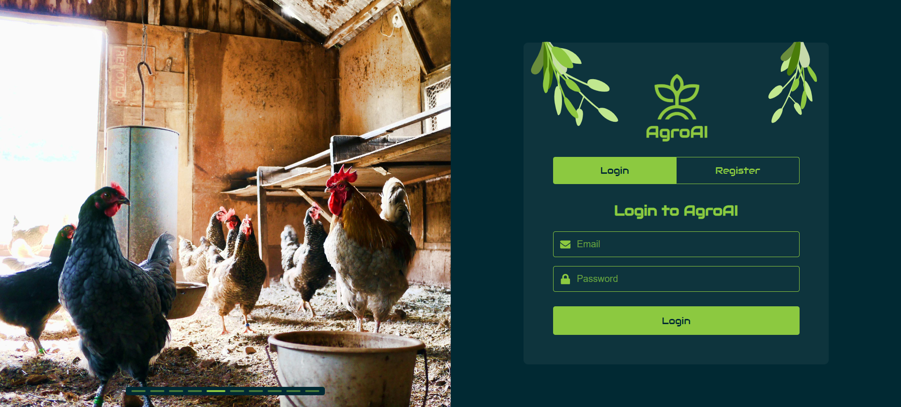
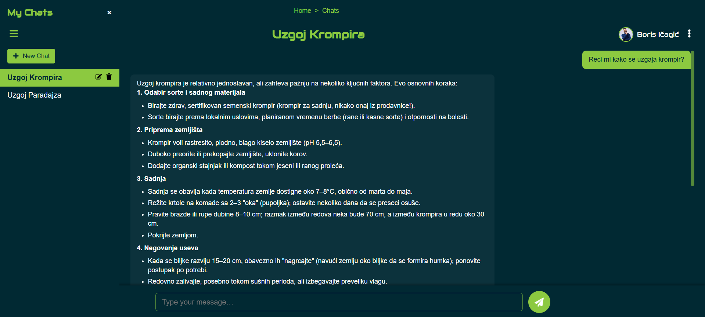

# Agro AI — React/Laravel full-stack aplikacija

Agro AI je moderna full-stack aplikacija za razgovor sa AI-jem i administraciju korisnika u agro domenu. Frontend je razvijen u **Reactu** (SPA, React Router, Recharts, react-icons, React Markdown), a backend koristi **Laravel** sa REST API-jem, **Sanctum** autentikacijom i Resource slojem. Aplikacija nudi korisničke razgovore (chat) sa AI-jem, upravljanje sopstvenim chatovima i bogat admin panel (grafici, najnovije AI vesti i pregled popularnih AI modela).


---

## Kratak pregled

Neulogovani korisnik vidi javne stranice i forme za registraciju/prijavu. Nakon prijave, **regularni korisnik** dobija ekran za razgovor (kreiranje, uređivanje i brisanje svojih chatova, slanje poruka i automatski AI odgovor). **Administrator** dobija dodatne menije: upravljanje korisnicima, grafičke statistike (Recharts), poslednje AI vesti (Hacker News – bez API ključa) i pregled top AI modela.

Seed-ovi mogu automatski popuniti **avatar slike korisnika** korišćenjem **Pexels public API-ja** (pojam pretrage „corporate man“) uz `PEXELS_API_KEY` u `.env` fajlu.

---

## Korisničke uloge

- **Neulogovani korisnik**  
  Vidi javne stranice i može da se registruje ili prijavi. Nema pristup zaštićenim rutama niti podacima.

- **Regularni korisnik**  
  Ima svoj **Chat** prostor: kreira novi chat, preimenuje ili briše sopstvene razgovore, šalje poruke i prima AI odgovore (render Markdown + GFM). UI skroluje poruke, a dugmad **Edit/Delete** se pojavljuju *samo* na selektovanom chatu.

- **Administrator**  
  Dobija **Admin Dashboard** sa sledećim celinama:  
  1) **Users** – pregled, pretraga, sortiranje po imenu, izmena korisnika i avatar slika.  
  2) **User Graphs** – grafički uvidi (Recharts: Pie/Bar) iz `/api/users/statistics`.  
  3) **Top AI Models** – tabela najpopularnijih modela (downloads) sa sortiranjem.  
  4) **Latest AI News** – najnovije AI vesti (Hacker News Algolia API, bez ključa).

---

## Ekrani (screenshotovi)

- Početna:  
  

- Registracija i prijava:  
    
  

- Chat interfejs (regularni korisnik):  
  

- Admin — Users:  
  

- Admin — User Graphs:  
  

- Admin — Top AI Models:  
  

- Admin — Latest AI News:  
  

---

## Tehnologije

- **Frontend:** React (SPA), React Router, Recharts (grafici), React Markdown (GFM), react-icons, prilagođen UI (tamna tema, breadcrumbs).  
- **Backend:** Laravel, REST Resources, **Sanctum** tokeni, validacija, role-based provere, rute za chats/messages/users i **`/api/users/statistics`** za agregate.  
- **Mediji/seed:** **Pexels API** (pojam: „corporate man“) preko `PEXELS_API_KEY` u `.env` – koristi se u `UserFactory` za generisanje avatar slika.  
- **Vesti:** „Latest AI News“ koristi **Hacker News Algolia** public API (bez ključa).  
- **UX:** sortiranje korisnika po imenu, inline preimenovanje chata, potvrda pre brisanja, paginacija tabela, KPI kartice u admin analitici.

---

## Šta dobijate

Agro AI spaja **AI razgovor** i **administrativni nadzor** u jednoj aplikaciji spremnoj za dalji razvoj (npr. agro preporuke, sezonski saveti, IoT integracije). Struktura je jasna (React klijent + Laravel server), pa je dodavanje novih ekrana i API endpoint-a jednostavno.


---
Instalacija i pokretanje
---------------------------

1. Klonirajte repozitorijum:
```bash
    git clone https://github.com/elab-development/internet-tehnologije-2024-projekat-agroai_chatbot_20210030_20210164.git
```
2. Pokrenite backend:
```bash
   cd agroai-backend
   composer install
   php artisan migrate:fresh --seed
   php artisan serve
```
    
3. Pokrenite frontend:
```bash
   cd agroai-frontend
   npm install
   npm start
```
    
4.  Frontend pokrenut na: [http://localhost:3000](http://localhost:3000) Backend API pokrenut na: [http://127.0.0.1:8000/api](http://127.0.0.1:8000/api)